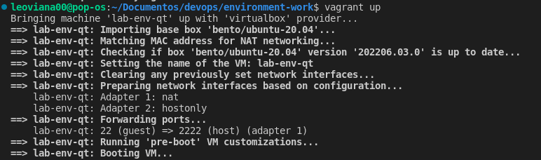

<h1 align="center">DevOps - AUTOMATIZAÇÃO DE CONFIGURAÇÃO DE UM AMBIENTE PARA DESENVOLVIMENTO</h1>

## Environment Automation

- Prparação de um script para preparar um ambiente de trabalho

## Tolls

- ShellScript
- Vagrant
- Virtualbox

## Ambiente para teste do script

- Utilizando `vagrantfile` para subir uma vm no virtualbox para teste.

```bash
vagrant up
```
<p align="center">
  
</p>

- Acessando a vm

```bash
vagrant ssh lab-env-qt
```
- Criar o script e copiar o conteúdo de script.sh dentro dele.
```bash
sudo nano install.sh
```

- Dar permissão ao script
```bash
sudo chmod +x install.sh
```

- Executar o script 
```bash
sudo bash install.sh
```
<p align="center">
  
</p>


## Referência
- Projeto tendo como base: https://github.com/alfredocoj/install_developers